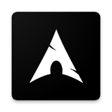

# Archlinux riscv64 Term

---------------------------------

## Introduction

- Archlinux riscv64 Term is a terminal and Linux environment application for Android.
A key difference of other terminal applications is that it uses
[Arch Linux](https://archlinux.org/) running inside the headless
riscv64 machine emulated with [QEMU](https://www.qemu.org/). Interaction
with the operating system is done through terminals which are attached to
the serial consoles of the virtual machine.

## Demo

## Usage
You should put the qcow2 image in /storage/emulated/0/archriscv.qcow2
No other path supported.
You can get the image using [CoelacanthusHex/archriscv-scriptlet](https://github.com/CoelacanthusHex/archriscv-scriptlet)
 - A demo image is provided(It was contained in the demo apk,and it is also in data-demo.bin which is a zip archive):
 - username: root
 - password: toor
 - the default shell is bash , but you can run `chsh -s /bin/nu` to use [nushell](https://github.com/nushell/nushell) (IT'S REALLY FAST WITH ALL MODERN FEATURES!!!)
## System requirements

 - AArch64-based device.
 - Android 7.0+
 - At least 5GB of space on the internal storage.(might use more if you use the with-demo edition)
 - Internet (if you want to install/update packages).
## Building
 - Just like normal gradle project ,run `cd archriscv-app && gradle build`
 - 
## Credits

Archlinux riscv64 Term utilizes source code of the following projects:

 - [Termux](https://github.com/termux/termux-app)
 - [QEMU](https://qemu.org)
 - [Bash](http://www.gnu.org/software/bash/bash.html)
 - [Busybox](https://busybox.net)
 - [Socat](http://www.dest-unreach.org/socat/)
 - [Advanced Copy](https://github.com/jarun/advcpmv)
 - [Alpine Term](https://github.com/ichit/alpine-term)
 - (I cannot find the source of alpine-term,this is a clone from @ichit)
